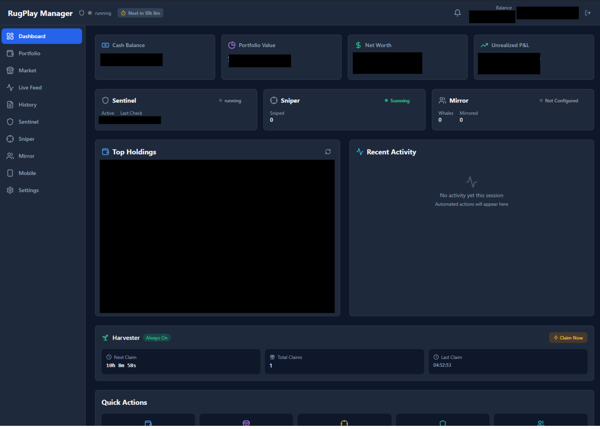
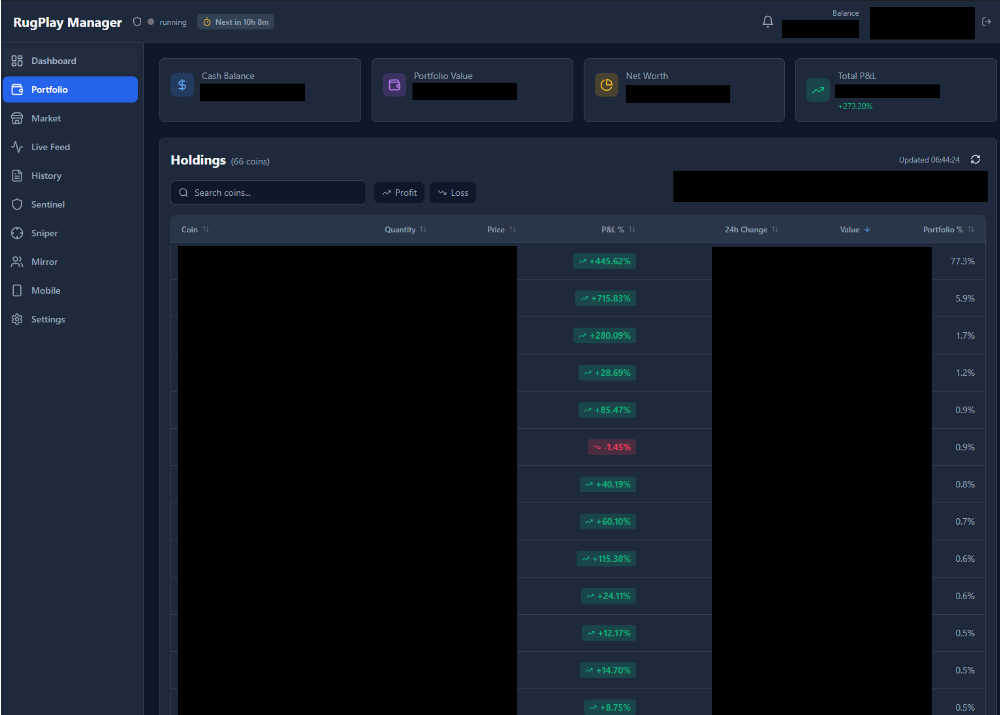
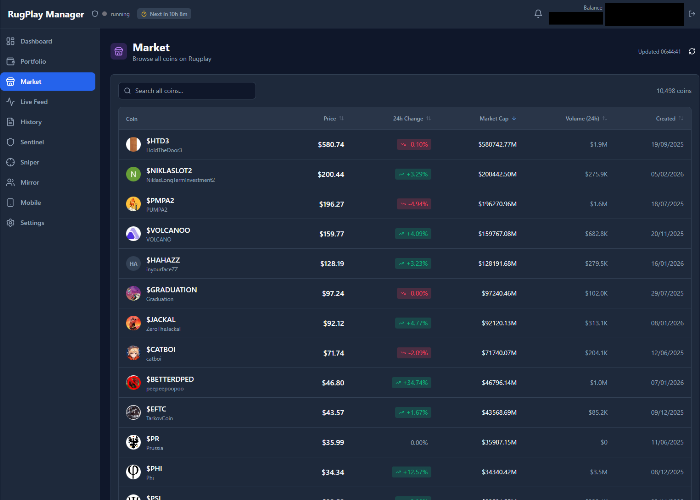
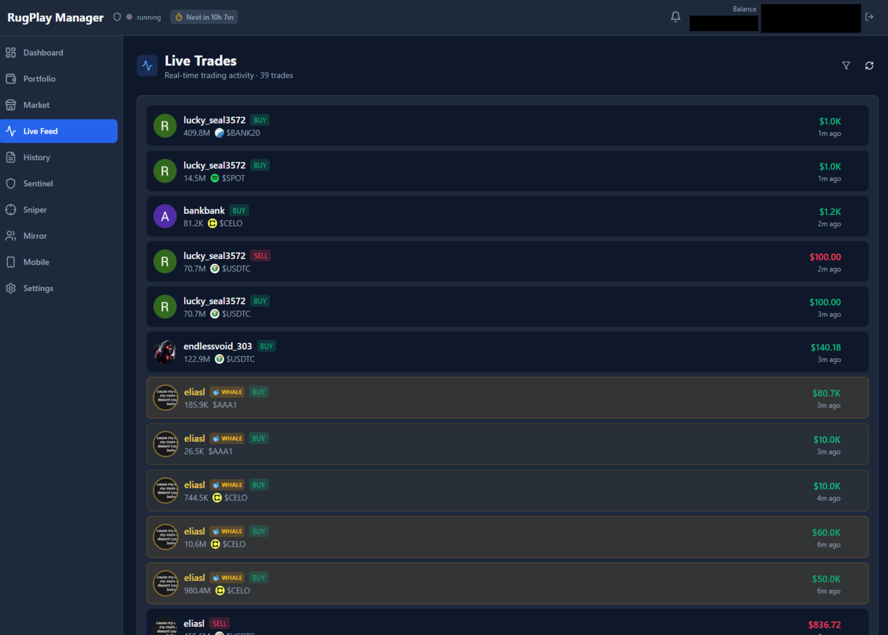
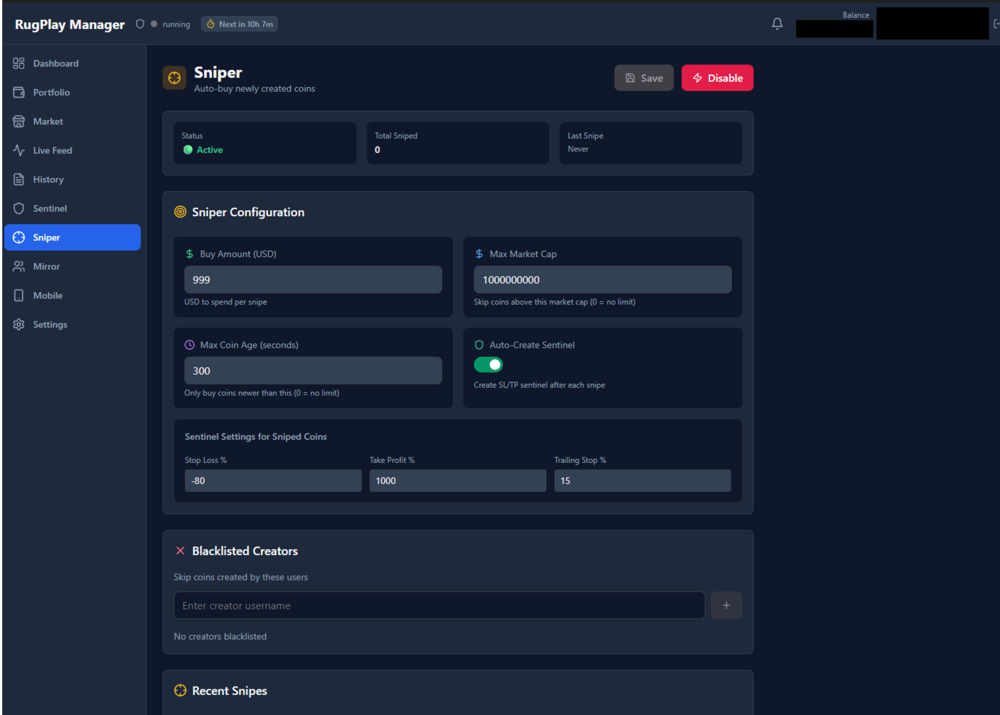
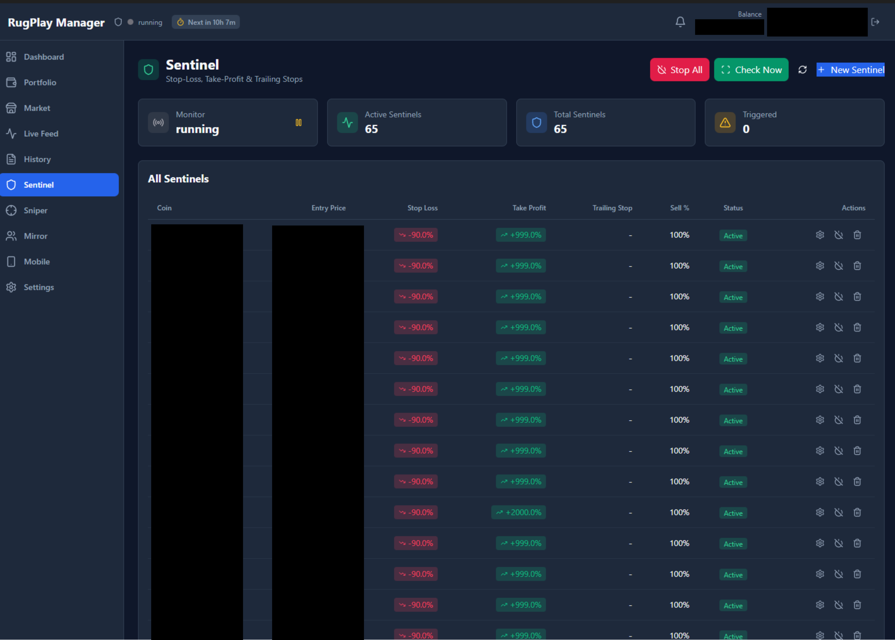
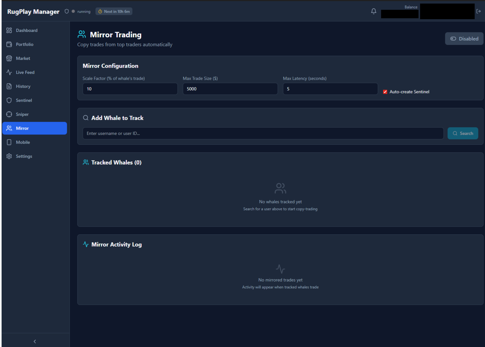
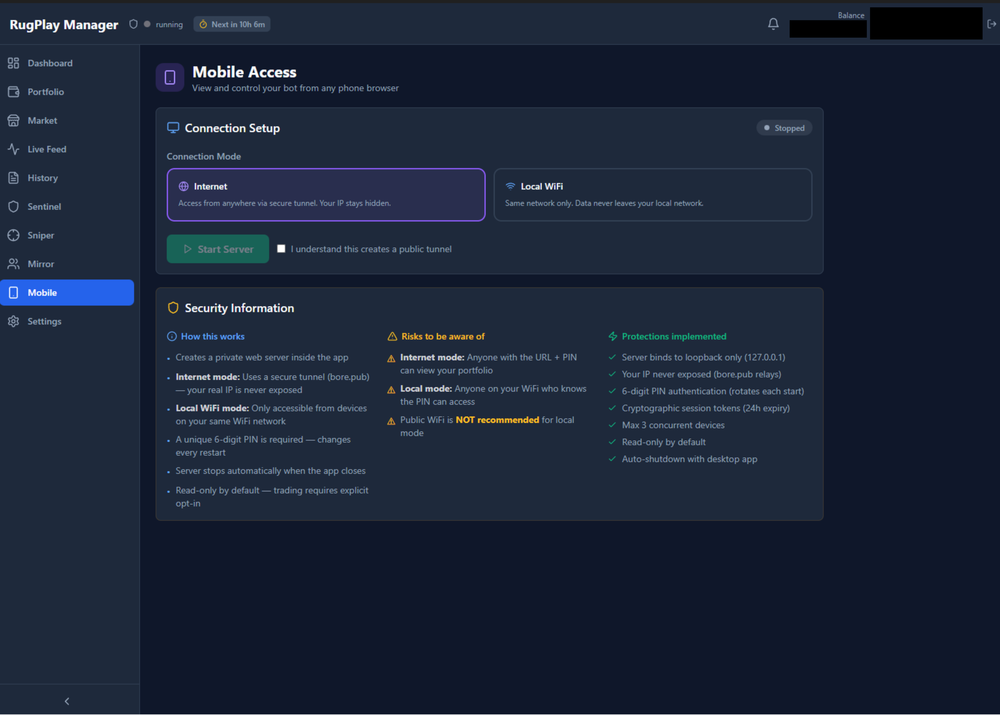

<div align="center">

<!-- HERO BANNER -->


# RugPlay Manager

### The Ultimate Open-Source Trading Bot for [Rugplay.com](https://rugplay.com)

**Automate your trades. Copy the whales. Protect your portfolio. All from your desktop.**

[](LICENSE)
[](https://www.rust-lang.org/)
[](https://v2.tauri.app/)
[](https://github.com/)
[](https://github.com/)

<br />

<!-- HERO SCREENSHOT -->


<br />

**Star this repo if you find it useful — it helps others discover it.**

<br />

[Download Latest Release](../../releases/latest) · [Full Documentation](#documentation) · [Report Bug](../../issues/new?template=bug_report.md) · [Request Feature](../../issues/new?template=feature_request.md)

</div>

---

<!-- NAVIGATION TABS -->
<div align="center">

### Quick Navigation

[**Overview**](#what-is-rugplay-manager) · [**Features**](#features-at-a-glance) · [**Screenshots**](#screenshots) · [**Installation**](#installation) · [**Build From Source**](#build-from-source) · [**Security**](#security--transparency) · [**FAQ**](#faq) · [**Message to FaceDev**](#a-message-to-facedev)

</div>

---

## What is RugPlay Manager?

**RugPlay Manager** is a free, open-source Windows desktop application that automates trading on [Rugplay.com](https://rugplay.com) — the popular cryptocurrency trading simulator created by [FaceDev](https://www.youtube.com/@FaceDevStuff).

> **Rugplay** is a risk-free crypto simulator where you trade with virtual currency. RugPlay Manager helps you get the most out of this experience by automating strategies, protecting your portfolio, and copying successful traders — all while keeping your account secure.

### Why RugPlay Manager?

| Problem                                   | Solution                                                         |
| ----------------------------------------- | ---------------------------------------------------------------- |
| Missing profitable trades while you sleep | **Sniper Bot** — Auto-buys new coins the instant they launch     |
| Watching profits evaporate                | **Sentinel** — Automated Stop-Loss, Take-Profit & Trailing Stops |
| Can't keep up with whale traders          | **Mirror Trading** — Copy top traders' moves in real-time        |
| Forgetting to claim daily rewards         | **Harvester** — Auto-claims your 12h rewards on schedule         |
| Can't monitor trades on the go            | **Mobile Access** — Control everything from your phone           |

---

## Features at a Glance

<div align="center">

|       Module       |                           Description                           | Status |
| :----------------: | :-------------------------------------------------------------: | :----: |
|   **Dashboard**    | Real-time portfolio overview, P&L tracking, balance monitoring  |  Live  |
|     **Sniper**     | Auto-buy newly launched coins with configurable amount & timing |  Live  |
|    **Sentinel**    |       Stop-Loss / Take-Profit / Trailing Stop automation        |  Live  |
| **Mirror Trading** |    Copy whale traders' buys & sells, scaled to your bankroll    |  Live  |
|   **Harvester**    |                Automatic 12-hour reward claiming                |  Live  |
|   **Live Feed**    |          Real-time trade feed showing market activity           |  Live  |
| **Market Browser** |       Browse, search & filter all coins with live prices        |  Live  |
|   **Portfolio**    |            Detailed holdings view with P&L per coin             |  Live  |
| **Mobile Remote**  |   Control & monitor your bot from any phone via secure tunnel   |  Live  |
|    **Settings**    |     Per-module configuration with risk management controls      |  Live  |

</div>

---

## Screenshots

> Click any section to expand and view the screenshot.

<details open>
<summary><h3>Dashboard — Your Command Center</h3></summary>
<div align="center">

</div>

> Real-time overview of your portfolio value, balance, profit & loss, and active module status — all at a glance.

</details>

<details>
<summary><h3>Portfolio — Track Every Holding</h3></summary>
<div align="center">

</div>

> See every coin you hold with live prices, quantity, P&L percentage, cost basis, and current value. Sell directly from the portfolio view.

</details>

<details>
<summary><h3>Market — Browse All Coins</h3></summary>
<div align="center">

</div>

> Browse the entire Rugplay market with sorting, filtering, search, and one-click trading. Live price updates and 24h change indicators.

</details>

<details>
<summary><h3>Live Feed — See the Market Pulse</h3></summary>
<div align="center">

</div>

> Watch trades happen in real-time across the entire Rugplay platform. See who's buying what, identify trends, and spot whale movements as they happen.

</details>

<details>
<summary><h3>Sniper — Never Miss a Launch</h3></summary>
<div align="center">

</div>

> Configure automatic purchases for newly launched coins. Set your buy amount, and the Sniper will execute the trade the moment a new coin appears — giving you first-mover advantage.

</details>

<details>
<summary><h3>Sentinel — Protect Your Profits</h3></summary>
<div align="center">

</div>

> Set Stop-Loss, Take-Profit, and Trailing Stop orders on any holding. Sentinel monitors prices continuously and executes automatically — even while you sleep.

</details>

<details>
<summary><h3>Mirror — Copy the Whales</h3></summary>
<div align="center">

</div>

> Add whale traders to your watchlist and automatically mirror their trades, scaled proportionally to your bankroll. If they buy 5% of their portfolio, you buy 5% of yours.

</details>

<details>
<summary><h3>Mobile — Control From Anywhere</h3></summary>
<div align="center">

</div>

> Access your bot from any device via a secure tunnel. Scan the QR code, enter your PIN, and monitor your portfolio, view trades, and check module status — all from your phone.

</details>

---

## Installation

### Quick Start (Recommended)

1. **Download** the latest installer from the [**Releases Page**](../../releases/latest)
2. **Run** `RugPlay Manager_x64-setup.exe` and follow the setup wizard
3. **Launch** RugPlay Manager from the Start Menu or Desktop shortcut
4. **Enter** your Rugplay session token (see below)
5. **Start trading**

### Getting Your Session Token

RugPlay Manager needs your session cookie to interact with Rugplay on your behalf. Here's how to get it:

1. Go to [rugplay.com](https://rugplay.com) and **log in**
2. Press `F12` to open Developer Tools
3. Go to the **Application** tab (Chrome) or **Storage** tab (Firefox)
4. Under **Cookies** > `https://rugplay.com`
5. Find `__Secure-better-auth.session_token`
6. **Copy the value** and paste it into RugPlay Manager

> **Security Note:** Your session token is encrypted with AES-256 before being stored locally. It never leaves your machine. See our [Security Documentation](docs/SECURITY.md) for full details.

### System Requirements

| Requirement  |             Minimum              |
| :----------: | :------------------------------: |
|    **OS**    |   Windows 10 (64-bit) or later   |
|   **RAM**    |               4 GB               |
|   **Disk**   |              100 MB              |
| **Internet** | Required (to connect to Rugplay) |

> **Detailed installation guide:** [docs/INSTALLATION.md](docs/INSTALLATION.md)

---

## Build From Source

Want to audit the code yourself? Build it from source — we encourage it.

### Prerequisites

- [Rust](https://rustup.rs/) (latest stable)
- [Node.js](https://nodejs.org/) (v18+)
- [Tauri CLI](https://v2.tauri.app/start/prerequisites/)

### Build Steps

```powershell
# Clone the repository
git clone https://github.com/DidCodeHere/RugPlay_Manager.git
cd RugPlay_Manager

# Install frontend dependencies
cd gui
npm install

# Run in development mode (hot-reload)
cargo tauri dev

# Build release .exe
cargo tauri build
```

The compiled executable will be in `target/release/`. Installers (MSI and NSIS) will be in `target/release/bundle/`.

> **Detailed build guide with troubleshooting:** [docs/BUILDING.md](docs/BUILDING.md)

---

## Architecture

RugPlay Manager is built as a **Cargo workspace** with deeply modular crates:

```
rugplay-manager/
├── crates/
│   ├── core/           # Data models, types, error definitions
│   ├── networking/     # HTTP client, API wrappers, WebSocket
│   ├── engine/         # Trading strategies (Sniper, Mirror, Sentinel)
│   └── persistence/    # SQLite database, encryption, caching
├── gui/
│   ├── src-tauri/      # Rust backend — Tauri commands, mobile server
│   └── src/            # React frontend — TypeScript + Tailwind + Shadcn UI
└── DemoImages/         # Screenshots for documentation
```

|     Layer      |      Technology       |                    Purpose                    |
| :------------: | :-------------------: | :-------------------------------------------: |
|  **Backend**   |     Rust + Tokio      | Async runtime, all API calls, trade execution |
|  **Frontend**  |  React + TypeScript   |           Interactive dashboard UI            |
|  **Styling**   | Tailwind CSS + Shadcn |      Dark-themed, responsive components       |
| **Framework**  |       Tauri 2.0       |     Native desktop app with web frontend      |
|  **Database**  |     SQLite (SQLx)     | Local storage for holdings, settings, history |
| **Encryption** |      AES-256-GCM      |       Session token encryption at rest        |

> **Full architecture deep-dive for auditors:** [docs/ARCHITECTURE.md](docs/ARCHITECTURE.md)

---

## Security & Transparency

<div align="center">

### This project is 100% open source. We have nothing to hide.

</div>

We know that giving any application your session token is a big ask. That's exactly why RugPlay Manager is **fully open source** — every single line of code is right here for you to inspect.

### What RugPlay Manager Does

- Sends requests to `rugplay.com` API endpoints (buying, selling, portfolio, market data)
- Stores your session token **encrypted** (AES-256-GCM) in a local SQLite database
- Runs entirely on **your machine** — no external servers, no telemetry, no analytics

### What RugPlay Manager Does NOT Do

- **Never** sends your token to any third-party server
- **Never** collects analytics, telemetry, or usage data
- **Never** accesses anything outside of `rugplay.com`
- **Never** stores your Rugplay password (we don't even ask for it)
- **Never** modifies your Rugplay account settings

### Audit It Yourself

**We actively encourage you to verify our claims:**

1. **Read the source code** — Every file is here in this repo
2. **Press F12 while running** — Open DevTools and watch the Network tab. You'll see every single HTTP request the app makes — all going to `rugplay.com` and nowhere else
3. **Check your firewall** — Monitor outbound connections. The only destination is `rugplay.com` (and `bore.pub` only if you enable Mobile Access)
4. **Build from source** — Don't trust our `.exe`? Clone the repo, read the code, and [build it yourself](#build-from-source)
5. **Search for exfiltration** — `grep -r "fetch\|http\|request" crates/` — every network call is to Rugplay's API

> **Comprehensive security documentation:** [docs/SECURITY.md](docs/SECURITY.md)

---

## FAQ

<details>
<summary><b>Is this a virus / malware / token stealer?</b></summary>

**No.** The entire source code is open for inspection. We encourage you to:

- Read every line of code in this repository
- Build it from source if you don't trust our release
- Monitor network traffic with F12 DevTools or Wireshark
- Check community reviews and audits

The app communicates **exclusively** with `rugplay.com`. Your token is encrypted locally and never transmitted anywhere.

</details>

<details>
<summary><b>Will I get banned from Rugplay?</b></summary>

RugPlay Manager emulates standard browser requests. From Rugplay's server perspective, it looks identical to you clicking buttons in your browser. That said, any automation carries inherent risk — use at your own discretion.

</details>

<details>
<summary><b>Is this against Rugplay's Terms of Service?</b></summary>

We've designed RugPlay Manager to be as respectful as possible — it doesn't exploit bugs, manipulate markets, or gain unfair advantages beyond automation speed. We've included rate limiting to avoid excessive API calls. See our [message to FaceDev](#a-message-to-facedev) below.

</details>

<details>
<summary><b>Does this work on Mac / Linux?</b></summary>

Currently, RugPlay Manager is built and tested for **Windows only**. Since it's built on Tauri (which supports cross-platform), Mac/Linux support is technically possible — PRs welcome!

</details>

<details>
<summary><b>My session token expired — what do I do?</b></summary>

Session tokens expire periodically. Simply:

1. Go to [rugplay.com](https://rugplay.com) and log in again
2. Get your new session token from DevTools (F12 > Application > Cookies)
3. Update the token in RugPlay Manager's auth screen
</details>

<details>
<summary><b>Is this free?</b></summary>

**Yes, 100% free and open source forever.** No premium tiers, no paywalls, no subscriptions. MIT Licensed.

</details>

<details>
<summary><b>How is this different from other Rugplay bots?</b></summary>

Most bots are closed-source scripts with no UI, no transparency, and no way to verify what they do with your token. RugPlay Manager is:

- A full native desktop app (not a throwaway Python script)
- 100% open source (inspect every line)
- A polished dark-themed GUI (not a terminal window)
- Mobile-accessible (monitor from your phone)
- Security-first (AES-256 encryption, no telemetry)
</details>

---

## A Message to FaceDev

<div align="center">


</div>

Hey **FaceDev**,

First and foremost — **thank you** for creating Rugplay. Seriously. What you've built is something genuinely special. In a space full of scams, rug pulls, and platforms that prey on beginners, you created a **safe, fun, educational playground** where people can learn about crypto trading without risking a single real penny. That takes vision, and it takes heart.

I spend a lot of time on your platform and it's clear how much thought and care you put into every update, every feature, and every interaction with the community. The regular YouTube updates, the transparency about your development process, and the genuine enthusiasm you bring to every video — it all adds up to something rare in this space: a creator who actually gives a damn.

I know the idea of a trading bot on your platform might initially seem concerning, and I completely understand that reaction. That's why I want to be fully transparent about this project and what I've done to keep things fair:

- **Fully open source** — Anyone can audit every line. No hidden tricks, no exploits.
- **Rate-limited requests** — The bot doesn't hammer your servers. It sends requests at the same pace a human would.
- **No exploit abuse** — No market manipulation, no price exploits, no bug abuse. Just automation of the same actions anyone can do manually.
- **Educational value** — This project teaches people about trading strategies, risk management, and software engineering.
- **Drives new users to Rugplay** — Players discover Rugplay through this tool and stay for the experience you've created.

If anything in this project crosses a line you're not comfortable with, **please reach out** — I'll address it immediately. Your platform, your rules. I respect that fully.

Thank you for the incredible content on your channel, for the constant updates, the engagement with the community, and for genuinely caring about the people who use your platform. Keep building — you're creating something awesome.

---

<div align="center">

### Subscribe to FaceDev on YouTube

FaceDev is the creator of [Rugplay.com](https://rugplay.com) and creates great content about web development, building startups, and the journey behind Rugplay.

<br />

[](https://www.youtube.com/@FaceDevStuff?sub_confirmation=1)

[](https://rugplay.com)

**If you enjoy Rugplay, go show FaceDev some love — hit that subscribe button.**

</div>

---

## Documentation

|                  Document                  |                      Description                      |
| :----------------------------------------: | :---------------------------------------------------: |
| [Installation Guide](docs/INSTALLATION.md) | Step-by-step download, setup, and token configuration |
|     [Feature Guide](docs/FEATURES.md)      |  Deep dive into every module with configuration tips  |
|   [Build From Source](docs/BUILDING.md)    |    Prerequisites, build steps, and troubleshooting    |
|    [Architecture](docs/ARCHITECTURE.md)    |   Codebase structure for auditors and contributors    |
|        [Security](docs/SECURITY.md)        | Transparency report, audit guide, encryption details  |
|         [Changelog](CHANGELOG.md)          |           Version history and update notes            |
|      [Contributing](CONTRIBUTING.md)       |  How to contribute, report bugs, or request features  |

---

## Contributing

We welcome contributions of all kinds! Whether it's:

- **Bug reports** — Found something broken? [Open an issue](../../issues/new?template=bug_report.md)
- **Feature requests** — Have an idea? [Tell us about it](../../issues/new?template=feature_request.md)
- **Code audits** — Review our code and share your findings
- **Documentation** — Help improve our guides
- **Translations** — Help make RugPlay Manager accessible to more people

See [CONTRIBUTING.md](CONTRIBUTING.md) for detailed guidelines.

---

## License

This project is licensed under the **MIT License** — see the [LICENSE](LICENSE) file for details.

You are free to use, modify, and distribute this software. Attribution is appreciated but not required.

---

<div align="center">

**Built for the Rugplay community**

<br />

<sub>RugPlay Manager is an independent fan project and is not officially affiliated with or endorsed by Rugplay.com or FaceDev.</sub>

<br />

<sub>If you found this useful, consider starring the repo — it really helps with discoverability.</sub>

</div>
